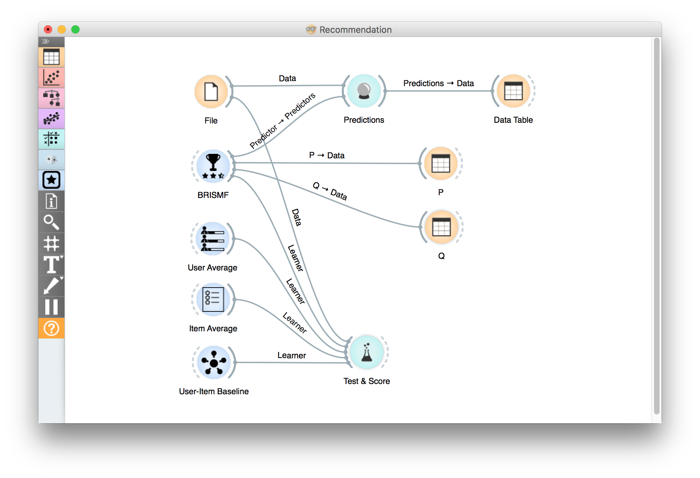

=====
SVD++
=====

Matrix factorization model which makes use of implicit feedback information.

Signals
-------

**Inputs**:

-  **Data**

Data set.

-  **Preprocessor**

Preprocessed data.

**Outputs**:

-  **Learner**

The learning algorithm with the supplied parameters.

-  **Predictor**

Trained recommender. Signal *Predictor* sends the output signal only if
input *Data* is present.

-  **P**

Latent features of the users.

-  **Q**

Latent features of the items.

-  **Y**

Latent features of the implicit information.

Description
-----------

**SVD++** widget uses a biased regularized algorithm which makes use of implicit
feedback information to factorize a matrix into three low rank matrices as it's
explained in *Y. Koren, Factorization Meets the Neighborhood: a Multifaceted
Collaborative Filtering Model*

Example
-------

Below is a simple workflow showing how to use both the *Predictor* and
the *Learner* output. For the *Predictor* we input the prediction model
into :doc:`Predictions<../evaluation/predictions>` widget and view the results in :doc:`Data Table<../data/datatable>`. For
*Learner* we can compare different learners in :doc:`Test&Score<../evaluation/testlearners>` widget. Moreover, we can output both
the user and item latent features.

